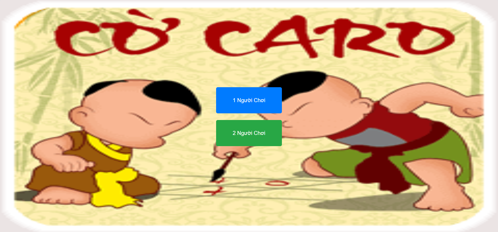
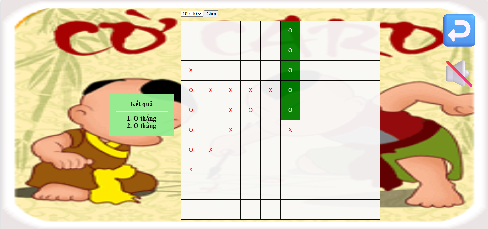

# 🕹️ Gomoku (Caro) Game

This is a **static web-based Gomoku (Caro) game** implemented with **HTML, CSS, and JavaScript**.  
The game supports two modes:
- **Player vs Player**
- **Player vs Computer (AI)**

---

## 🎮 Game Features
- Selectable board sizes: **10x10**, **15x15**, or **20x20**
- Turn-based gameplay: Player **X** and Player **O** alternate moves
- Win condition: Align **five consecutive marks** (horizontally, vertically, or diagonally)
- Winning cells are highlighted when a player wins
- Background music with play/pause toggle 🔊
- “Back” button ↩️ to return to the homepage

---

## 🤖 Computer Mode

The AI opponent is powered by the **Minimax algorithm with Alpha-Beta pruning**.

### 🔑 Key points:
1. **Dynamic move generation**
    - Instead of scanning the whole board, the AI only considers moves near the most recent moves (`lastMoves`).
    - This significantly improves performance.

2. **Minimax with Alpha-Beta pruning**
    - The AI simulates moves up to a certain depth.
    - **Maximizing player (AI – O)** tries to maximize the score.
    - **Minimizing player (Human – X)** tries to minimize the score.
    - Alpha-Beta pruning reduces unnecessary calculations.

3. **Board evaluation function**
    - The AI evaluates potential lines of 5 cells in all directions (horizontal, vertical, diagonals).
    - Offensive weight: more consecutive **O’s** = higher score.
    - Defensive weight: blocking **X’s** is prioritized slightly more to prevent losing.
    - Example scoring:
        - 2 in a row → low score
        - 3 in a row → medium score
        - 4 in a row → very high score
        - 5 in a row → winning state

---

## 🛠️ How It Works
1. Player clicks an empty cell → board updates with their move.
2. System checks for win condition (five in a row).
3. If in **computer mode** and game not over:
    - AI evaluates all possible moves within the search range.
    - Runs **Minimax** to choose the best move.
    - AI places “O” on the board.
4. Repeat until one player wins.

---

## 🚀 Tech Stack
- **Frontend**: HTML, CSS, JavaScript
- **Logic**: Minimax Algorithm + Alpha-Beta Pruning

👉 This project is a lightweight, fun Gomoku experience directly in the browser with **no backend or external libraries required**.  

## 🖼️ Screenshots
- **Menu**: 

- **Game Play**:
